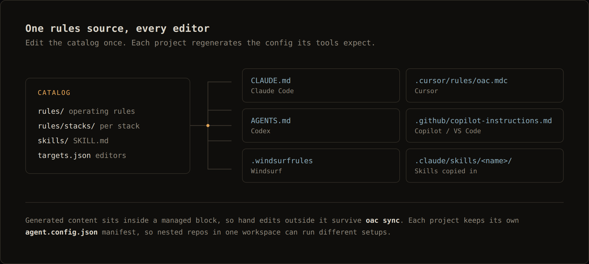
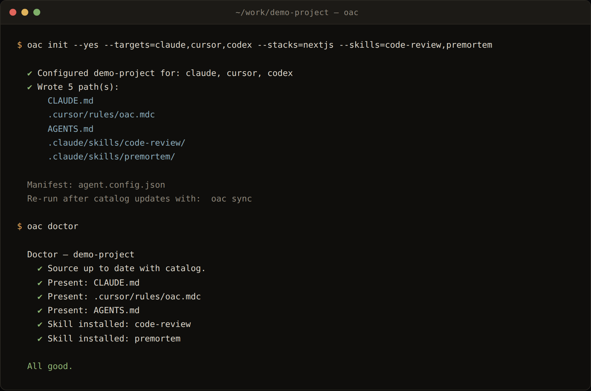

# open-agent-config (`oac`)

[](https://github.com/designbyheart/open-agent-config/actions/workflows/test.yml) [](package.json) [](LICENSE)

**One rules source. Every AI editor.** Write your engineering rules and skills once, and
`oac` generates the config each tool actually reads — `CLAUDE.md`, `AGENTS.md`,
`.cursor/rules/*.mdc`, `.github/copilot-instructions.md`, `.windsurfrules` — plus copies
the skills you selected into place.

Same rules in, same behaviour out, regardless of which editor a developer opens.
Cross-platform (Windows / macOS / Linux). Every project gets its own self-contained
config, so nested repos in one workspace can each run a different setup.



---

## Quick start

Requires **Node.js ≥ 18**.

```bash
# run it without installing
npx github:designbyheart/open-agent-config init

# or install the CLI globally
npm install -g github:designbyheart/open-agent-config
oac init
```

`init` is interactive: pick your editors, stacks, and skills. Then, in any project:

```bash
oac sync      # regenerate config after the catalog changes
oac doctor    # verify config is present, intact, and current
```

Non-interactive, for CI or scripting:

```bash
oac init --yes --targets=claude,cursor,codex --stacks=nextjs --skills=code-review
```



Pin a version by appending `#<ref>`, e.g. `npm install -g github:designbyheart/open-agent-config#v0.1.0`.
To uninstall: `npm uninstall -g open-agent-config`.

**Working inside a clone** (to edit the catalog or CLI):

```bash
npm install && npm link    # then: oac init   (re-run npm link per Node version if you use nvm)
node bin/cli.js init       # or run directly, without linking
```

---

## The problem it solves

Every AI editor invented its own convention for project instructions. A team using three
of them maintains the same engineering rules in three files, and within a month the
copies have drifted. Reviews get stricter in one tool than another, the same mistake gets
corrected in one place and not the others, and nobody can say which file is authoritative.

`oac` makes the catalog authoritative and treats every editor config as build output.

---

## How it works

```
open-agent-config/            ← this repo: the master catalog + the CLI
  catalog/
    rules/                    ← canonical source of truth (markdown fragments)
      00-operating-rules.md   ← numbered engineering ruleset (precision, token economy, delegation)
      10-communication-protocol.md ← response shape, reference points, boundaries, aliases
      20-voice-and-tone.md    ← delivery & persona
      stacks/                 ← optional stack-specific rules
    skills/<name>/SKILL.md    ← master skills catalog
    templates/                ← scaffolded into a project once, then owned by it
      communication-patterns.md
    targets.json              ← supported agents/editors
  src/  bin/                  ← the CLI

your-project/                 ← anywhere on disk
  agent.config.json           ← per-project manifest (what was selected)
  .oac/communication-patterns.md  ← yours to tune; scaffolded once, never overwritten
  AGENTS.md  CLAUDE.md  …     ← generated config, one per selected tool
  .claude/skills/<name>/      ← skills copied in (Claude)
```

You edit rules **once** in `catalog/rules/`. Each project's generated files are assembled
from those fragments and wrapped in a managed block
(`<!-- oac:start --> … <!-- oac:end -->`), so re-running keeps your hand edits outside the
block and only refreshes what `oac` owns.

### Per-project communication patterns

The catalog rules are shared and regenerated; some things should differ per project.
`oac init` scaffolds `.oac/communication-patterns.md` from a prefilled template and then
never touches it again. Its content is **inlined into every generated config**, so it
reaches Cursor and Copilot too, not just the tools that can open the file.

Tune it, then `oac sync`. It covers:

| Section | What you put there |
| --- | --- |
| Prefer / Avoid | House style and the exact words and phrases to ban |
| Reference points | Short codes (`D1` decisions, `R1` risks, `F1` findings…) so you can say "expand R2" |
| Aliases | One-word expansions — `scr` simplify+compress, `eli` explain simply, `focus`, `ref`, `risk` |
| Boundaries | Commit and PR policy, paths that are off-limits without asking, autofix/docs/test dials |
| Domain vocabulary | Terms this project uses precisely, and what they must not be confused with |
| Examples | Real responses you liked, verbatim — in-context distillation beats describing what you want |

`oac doctor` reports drift when the file is edited but not synced. Opt out with
`oac init --no-patterns`; an existing file is still used either way.

### Anonymous usage counting

oac counts command runs so the author can tell whether anyone else uses it. It is
anonymous, it is off in CI, and one command turns it off for good:

```bash
oac telemetry          # status, plus the exact payload that would be sent
oac telemetry off      # stop, permanently
```

`DO_NOT_TRACK=1`, `OAC_TELEMETRY=0`, and `--no-telemetry` are all honoured.

| Sent | Never sent |
| --- | --- |
| Command name, outcome, duration | Project names or descriptions |
| oac / Node / OS / arch versions | Any filesystem path |
| Catalog ids selected (`claude`, `nextjs`, `code-review`) | File contents, git remotes, repo URLs |
| A random install id, generated locally | Usernames, hostnames, email |
| Whether the run was in CI | Error *messages* — only the error's class or code |

The install id is a `randomUUID()` stored in `~/.config/oac/config.json`, derived from
nothing. On the first run that would send anything, oac prints a notice to stderr saying
so, once. Requests time out after one second and failures are swallowed, so telemetry
cannot slow down or break a command — there is a test asserting exactly that.

Self-hosting this fork? Put your own Mixpanel project token in `src/telemetry.js`, or
leave the placeholder and telemetry stays permanently inert.

### Updating oac itself

```bash
oac update --check     # what's waiting, without touching anything
oac update             # apply it
```

`update` adapts to how oac was installed — nobody has to know which mode they are in:

| Installed as | What `update` does |
| --- | --- |
| A git checkout (`npm link`, or `npm i -g <path>`) | `git pull --ff-only` on the current branch, then `npm install` only if the manifest moved |
| A global install, package not on npm | `npm i -g github:<owner>/<repo>`, read from `package.json` |
| A published global package | `npm i -g open-agent-config@latest` |

If you work on the catalog, link it once and your edits are live the moment you save —
no reinstall, ever. `update` is then only for pulling *other people's* commits:

```bash
git clone https://github.com/designbyheart/open-agent-config.git
npm i -g ./open-agent-config      # linked: edits take effect immediately
```

Everyone else installs the published copy and updates the same way:

```bash
npm i -g github:designbyheart/open-agent-config   # until it's on npm
oac update                                        # whenever the rules change
oac sync                                          # in each project, to apply them
```

`update` refuses to pull into a dirty working tree and names the files blocking it, rather
than merging over uncommitted work. After updating, run `oac sync` in your projects — or
`oac doctor` to see which ones have fallen behind.

### Remembering the shorthand

Aliases and reference codes are only useful if you can recall them mid-task. `oac keys`
prints the card in any terminal or tmux pane, reading straight from the project's file:

```
  Aliases — type the token alone; the agent expands it
    scr    Simplify, compress, and repeat your last response.
    focus  What matters most here? What is the true signal?
    ev     Show the evidence for that claim — file, line, command, or output.

  Reference codes — "expand R2" instead of re-quoting
    R1, R2, …  Risks
    F1, F2, …  Findings
```

It also lists the project's installed skills and build/test/lint commands. Claude Code
targets additionally get a generated `.claude/commands/keys.md`, so `/keys` prints the
same card without leaving the session. Outside a configured project it falls back to the
catalog defaults.

### Adding skills to a repo that already has its own agent config

Use `--skills-only` to install skills and write the manifest **without** touching an
existing `AGENTS.md` / `CLAUDE.md` / `.cursorrules`. Skills land in `.claude/skills/`; no
rule files are generated or modified.

```bash
oac init --yes --skills-only --skills=commit-pr,review-pr --dir=~/work/existing-repo
```

---

## Targets and the files they get

| Target | Reads | `oac` writes |
| --- | --- | --- |
| Claude Code | `CLAUDE.md`, `.claude/skills/` | `CLAUDE.md` + copies selected skills |
| Codex / universal | `AGENTS.md` | `AGENTS.md` |
| Devin | `AGENTS.md` | `AGENTS.md` (shared/deduped with Codex) |
| Cursor | `.cursor/rules/*.mdc` | `.cursor/rules/oac.mdc` (with frontmatter) |
| GitHub Copilot / VS Code | `.github/copilot-instructions.md` | same |
| Windsurf | `.windsurfrules` | same |
| Ollama | — (launches a harness) | `.oac/ollama/LAUNCH.md` + `.sh`/`.ps1` launchers |

> **Skills note:** only Claude has a native skills mechanism, so skills are physically
> copied into `.claude/skills/` and loaded on demand (Claude's config just lists them).
> Every other tool reads a single instruction file, so the **full text of each selected
> skill is inlined** into that file (`AGENTS.md`, `.cursor/rules/oac.mdc`,
> `.github/copilot-instructions.md`, `.windsurfrules`) — the guidance reaches the tool
> instead of pointing at files it can't open. A skill's **bundled markdown** (its
> `references/`, `examples/`, …) is inlined too, under headings that match the paths the
> playbook cites, so router-style skills stay portable. Only **non-text** extras
> (scripts, assets, binaries) can't be inlined — skills that ship them say so, and those
> files travel only with a Claude Code install.

### Ollama models

Ollama is different from the others: it doesn't read a rules file. Instead,
`ollama launch <app> --model <tag>` starts an existing harness (Claude Code, Codex,
OpenCode, OpenClaw, Hermes, Codex App) with an Ollama model as the engine — and that
harness reads the `CLAUDE.md` / `AGENTS.md` that `oac` already generated.

Select the **Ollama** target and provide your model tags (defaults:
`kimi-k2.6:cloud`, `gemma4:cloud`, `minimax3:cloud`). `oac` writes:

- `.oac/ollama/LAUNCH.md` — a table of every `ollama launch` command for this project.
- `.oac/ollama/<app>--<model>.sh` and `.ps1` — one runnable launcher per app × model,
  each `cd`-ing to the project root so the rules files are picked up.

```bash
oac init --yes --targets=claude,codex,ollama \
  --ollama-models="kimi-k2.6:cloud,qwen3-coder:480b-cloud"

# then, from the project root:
./.oac/ollama/claude--kimi-k2.6-cloud.sh        # macOS / Linux
.\.oac\ollama\claude--kimi-k2.6-cloud.ps1       # Windows (PowerShell)
```

### Windows support

Fully cross-platform. The CLI uses only Node's `fs`/`path` (no shell, no symlinks),
and every Ollama launcher ships as both `.sh` (macOS/Linux) and `.ps1` (Windows
PowerShell 5.1+/7). Line endings are preserved per-file, and the executable bit is set
where the OS supports it (a no-op on Windows). Run via `npx github:designbyheart/open-agent-config`
(or the SSH form) on any OS.

---

---

## Adding rules and skills

- **Rules:** add or edit markdown in `catalog/rules/`. Files are included in filename
  order — prefix with numbers (`00-`, `10-`) to control sequence. Add stack-specific
  rules under `catalog/rules/stacks/<id>.md` with a `label:` frontmatter field.
- **Skills:** copy `catalog/skills/_example/` to `catalog/skills/<your-skill>/`, edit the
  `SKILL.md` frontmatter (`name`, `description`, `trigger`) and body. The whole folder is
  copied into a project when the skill is selected — including any `scripts/`,
  `references/`, `assets/`, `templates/`, or `agents/` subfolders.

  The `skill.json` metadata format is supported directly: drop a skill folder that contains both
  `SKILL.md` and a `skill.json` (`name`, `version`, `description`, `tags`, `entrypoint`)
  and `oac` reads its metadata from `skill.json`, falling back to the `SKILL.md`
  frontmatter (folded YAML `description: >` blocks included).

- **Importing skills** with `oac import-skill` instead of copying by hand:

  ```bash
  oac import-skill ~/Downloads/some-skill                 # a single skill folder
  oac import-skill ./skills-repo --all                    # every skill under a folder
  oac import-skill https://github.com/org/skills.git --all --from=skills
  oac import-skill <src> --name=my-id --force             # rename / overwrite
  ```

  It validates that each source has a `SKILL.md`, copies the whole folder (subdirs
  included) into `catalog/skills/`, and warns when it spots project-specific terms
  (e.g. a hard-coded company name or build tool) you may want to genericize first.

After editing the catalog, run `oac sync` in each project to roll out the change.

---

## Pre-push PR review hook

Get a **Copilot-style PR review on every `git push`**, before the code leaves your machine.
A git `pre-push` hook runs the [`pr-review`](catalog/skills/pr-review/SKILL.md) skill against
the diff being pushed (headless Claude Code), prints a summary + severity-tagged findings,
and **blocks the push only when a high-severity bug or security issue is found**.

**Requires:** the [`claude`](https://docs.claude.com/en/docs/claude-code) CLI on your `PATH`.
If it's missing, the hook prints a notice and lets the push through (never blocks you).

### 1. Install the skill into your repo

```bash
oac add-skill pr-review          # → .claude/skills/pr-review/   (run inside the repo)
```

The hook calls `claude -p "/pr-review"`, which loads this skill from `.claude/skills/`.

### 2. Install the hook

The hook ships as **two files** in [`hooks/`](hooks/):

- `pr-review-run` — the shared review body (reads the pre-push stdin, runs the review, gates on the verdict). One source of truth.
- `pre-push` — a thin **global wrapper** that delegates to a repo-local hook first, then runs `pr-review-run`.

**This repo only** (recommended — try it before rolling out). No wrapper needed; install the
body directly as the repo's hook:

```bash
# from the open-agent-config clone:
cp hooks/pr-review-run ~/work/your-repo/.git/hooks/pre-push
chmod +x ~/work/your-repo/.git/hooks/pre-push
```

**All your repos at once** (global) — git's `core.hooksPath` makes every repo use the wrapper,
which delegates to a repo-local `.git/hooks/pre-push` first so existing per-repo hooks keep
working:

```bash
mkdir -p ~/.config/git/hooks
cp hooks/pre-push hooks/pr-review-run ~/.config/git/hooks/
chmod +x ~/.config/git/hooks/pre-push ~/.config/git/hooks/pr-review-run
git config --global core.hooksPath ~/.config/git/hooks
```

**Husky repos** — git points `core.hooksPath` at `.husky/`, so the global wrapper above is
bypassed. Call the body directly from `.husky/pre-push` instead (assuming `pr-review-run` is on
your `PATH` or installed at `~/.config/git/hooks/`):

```sh
# .husky/pre-push
exec ~/.config/git/hooks/pr-review-run "$@"
```

### 3. Use it

```bash
git push                      # review runs automatically
git push --no-verify          # skip all hooks
SKIP_PR_REVIEW=1 git push     # skip just this review
claude -p "/pr-review origin/main..HEAD"   # run the review by hand, anytime
```

### Tuning

- **Change the gate** — by default only `VERDICT: BLOCK` (a `high`-severity finding) rejects
  the push. Edit the `grep '^VERDICT: BLOCK'` line in `hooks/pre-push`, or adjust the severity
  rules in `catalog/skills/pr-review/SKILL.md`.
- **Large diffs** are capped at 4000 lines and the review times out after 180s — both fail
  *open* (push allowed) so a slow review never traps you.

---

---

## Command reference

| Command | What it does |
| --- | --- |
| `oac init` | Interactive setup — editors, stacks, skills; writes all config + the manifest |
| `oac sync` | Regenerate every managed config file from the current catalog + manifest |
| `oac list [targets\|skills\|stacks]` | Show what the catalog offers |
| `oac add-skill <name>` | Add a catalog skill to this project |
| `oac remove-skill <name>` | Remove a skill and its installed folder |
| `oac import-skill <src>` | Import a skill from a path or git URL into the catalog |
| `oac doctor` | Verify config: missing files, broken managed blocks, stale catalog |

| Flag | Meaning |
| --- | --- |
| `--dir=<path>` | Operate on another directory (default: current) |
| `--targets=a,b` | `claude`, `codex`, `cursor`, `copilot`, `windsurf`, `ollama` |
| `--stacks=a,b` | Stack rule fragments (see `oac list stacks`) |
| `--skills=a,b` | Skills to install |
| `--skills-only` | Install skills + manifest only; never write or modify rule files |
| `--yes`, `-y` | Non-interactive; use defaults and flag values |

Full reference: [`CHEATSHEET.md`](CHEATSHEET.md).

---

## Contributing

Rules and skills live in `catalog/`. Add a markdown fragment, run `npm test`, open a PR.
New editor targets go in `catalog/targets.json` plus a renderer in `src/`.

## License

MIT — see [LICENSE](LICENSE).
